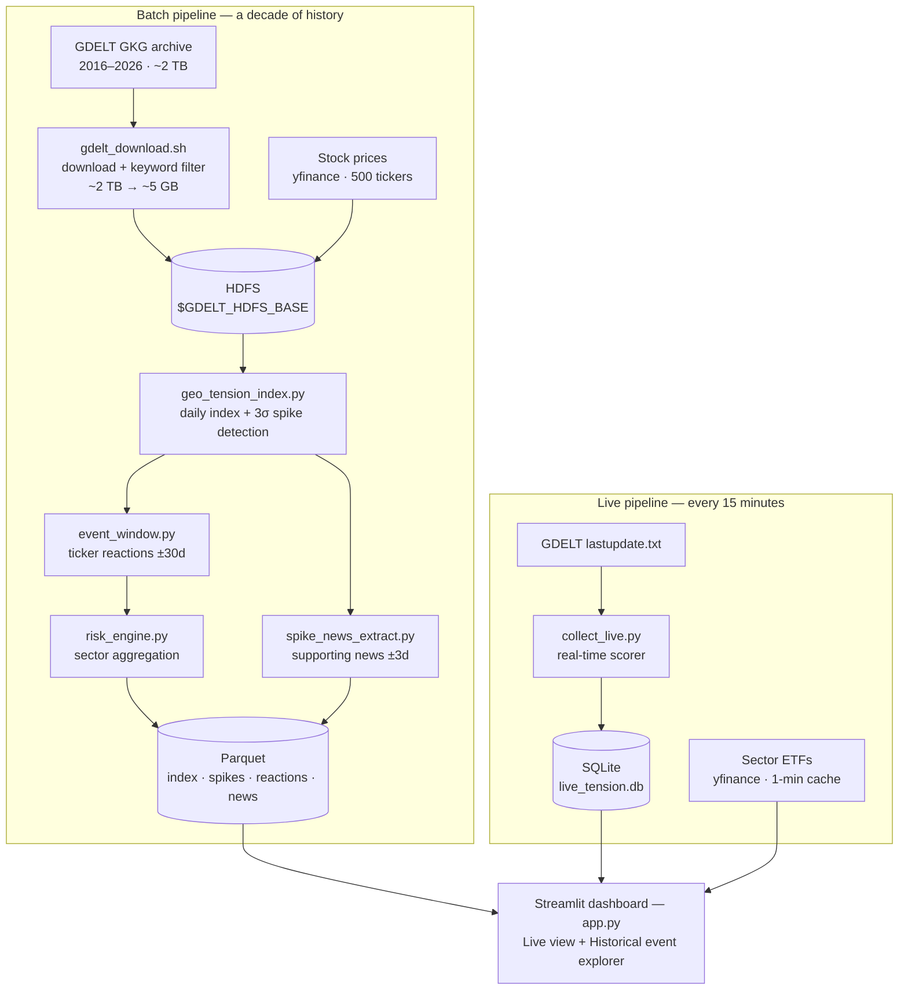

# Geopolitical Event-Driven Portfolio Risk Analysis Platform

> "VIX tells you how scared the market is. This tells you *why* — and what happened last time."

A big data platform that processes 10 years of GDELT global news data alongside S&P 500 price data to detect geopolitical tension spikes, analyze their historical market impact, and visualize the results in an interactive dashboard.

**Team:** David Hong · Jonghyun Jeong · Tinos Vafias — NYU Big Data (Spring 2026)  
**Cluster:** NYU Dataproc (Google Cloud, YARN)  
**Dashboard:** Streamlit + Plotly

**Paper:** [`docs/Final_Paper.pdf`](docs/Final_Paper.pdf) · **Slides:** [`docs/Final_Presentation.pdf`](docs/Final_Presentation.pdf)

---

## Overview

When geopolitical crises happen — wars, sanctions, coups, protests — markets react. But how? Which sectors go up? Which collapse? How fast does it normalize?

This platform answers those questions by:

1. Building a **Geo-Tension Index** from 10 years of GDELT news (2016–2026)
2. Detecting **31 international tension spikes** using statistical anomaly detection
3. Computing **sector-level stock reactions** for each spike event (±30 trading days)
4. Displaying everything in a **Streamlit dashboard** with historical event explorer

No machine learning. No prediction. Pure large-scale data engineering — fully explainable outputs.

---

## Team

| Name | NetID |
|------|-------|
| David Hong | sh8348 |
| Jonghyun Jeong | jj4335 |
| Tinos Vafias | cv2134 |

---

## Architecture

The platform runs on a two-speed pipeline. A batch layer processes a decade of history on Spark; a
live layer polls GDELT every 15 minutes. The dashboard sits on top of both at once, so a user sees
ten years of context and what is happening right now in the same interface.



---

## Repository Structure

```
GDELT_Risk_Analysis_Platform/
├── data_collection/
│   └── gdelt_download.sh          # Downloads & filters GDELT GKG (2016–2026)
├── pyspark_pipeline/
│   ├── geo_tension_index.py       # Builds daily Geo-Tension Index + detects spikes
│   ├── event_window.py            # Computes ticker reactions ±30d per spike
│   ├── risk_engine.py             # Aggregates sector-level risk scores
│   └── spike_news_extract.py      # Extracts news URLs per spike event
├── dashboard/
│   ├── app.py                     # Streamlit dashboard (2 tabs)
│   └── collect_live.py            # 15-min live GDELT collector → SQLite
├── docs/
│   ├── Final_Paper.pdf            # Full write-up
│   └── Final_Presentation.pdf     # Slide deck
├── requirements.txt               # Dashboard dependencies
└── requirements-pipeline.txt      # Adds PySpark for local batch development
```

---

## Geo-Tension Index

### Formula

```
geo_tension_raw = avg(negative_tone) × log(article_count + 1)
```

### Why this formula?

**`avg(negative_tone)`** — GDELT's V2Tone column provides comma-separated sentiment scores computed automatically from article full text. The third value is the negative score (range: 0–50). We use the daily average across all filtered articles.

Using raw sentiment alone has a flaw: a single highly negative article would score the same as a hundred moderately negative ones. Volume matters.

**`log(article_count + 1)`** — We weight sentiment by article volume to capture the "how much the world is talking about this" dimension. Log scale is used instead of linear because:
- News volume during major crises can spike 10x–50x above normal
- Linear scaling would make crisis days dominate the index and compress all other variation
- Log dampens explosive growth while still rewarding higher volume

**Multiplying the two** captures both *intensity* (how negative) and *scale* (how many articles). A ceasefire with many positive articles scores low. An invasion with massive negative coverage scores high.

**International filter** — Only articles referencing non-US country codes (e.g. `#RS#` for Russia, `#UP#` for Ukraine) are included. This removes US domestic news that would otherwise dominate the index and distort geopolitical signals.

**Normalization** — Final scores are scaled to 0–10 using p1–p99 percentile normalization, making the index interpretable across different time periods without being distorted by extreme outliers.

---

## Spike Detection

### Method

```
spike = geo_tension_index > yearly_mean + 3 × yearly_std
```

This is a Z-score based statistical anomaly detection approach. The threshold is computed **per year** to account for the fact that global news volume and sentiment vary across different periods (e.g. the Russia-Ukraine War era generated far more alarming coverage than 2018 or 2019). A 3σ threshold captures statistically extreme days — roughly the top 0.1% of tension scores — ensuring only genuine geopolitical shocks are flagged, not routine news cycles.

We tested multiple thresholds (1.5σ, 2σ, 3σ). 3σ gave the cleanest separation between routine noise and major geopolitical shocks.

### Labeling

Spike dates falling within known geopolitical events are manually labeled (e.g. "Russia-Ukraine War", "Israel-Hamas War"). For remaining dates, labels are auto-generated from the most frequent keywords in GDELT article titles within ±3 days of the spike.

---

## Data Pipeline

### Phase 1 — Historical Batch (PySpark on NYU Dataproc)

```bash
# 1. Download & filter GDELT
bash data_collection/gdelt_download.sh 2016 2026

# 2. Build Geo-Tension Index
spark-submit --deploy-mode client pyspark_pipeline/geo_tension_index.py

# 3. Detect spikes & compute ticker reactions
spark-submit --deploy-mode client pyspark_pipeline/event_window.py

# 4. Extract supporting news per spike
spark-submit --deploy-mode client pyspark_pipeline/spike_news_extract.py
```

### Phase 2 — Live Feed (in dashboard)

`app.py` polls `gdeltproject.org/gdeltv2/lastupdate.txt` every 15 minutes to fetch the latest GDELT GKG file and display current geopolitical headlines. Sector ETF returns (JETS, SOXX, XLE, ITA, XLK, GLD) are fetched via yfinance with a 1-minute cache. This matches GDELT's own update frequency.

---

## Why PySpark?

| Task | Why Spark? |
|------|-----------|
| Filter keywords from billions of records | Single machine cannot load the full GDELT archive (2TB+) |
| 500 tickers × 31 spikes × ±30-day windows | Distributed join across partitioned datasets |
| Sector-level aggregations across 500 tickers | Parallel groupBy + window operations |
| Daily tension index from 7.6M articles | Distributed aggregation at scale |

We intentionally chose batch over streaming. Both GDELT and market APIs update in discrete intervals — real-time streaming would add complexity without adding signal.

---

## Infrastructure

| Component | Tool |
|-----------|------|
| Cluster | NYU Dataproc (Google Cloud Dataproc) |
| Resource Manager | YARN |
| Distributed Processing | Apache Spark (PySpark) |
| Storage | HDFS + Parquet |
| Dashboard | Streamlit + Plotly |
| Live News Feed | GDELT GKG lastupdate.txt polling (15 min) |
| Live Sector Returns | yfinance ETF data (1 min cache) |
| Version Control | Git / GitHub |

---

## Data Sources

| Source | Description | Cost |
|--------|-------------|------|
| [GDELT Project](https://gdeltproject.org) | Global news events, sentiment (2016–present) | Free |
| [yfinance](https://github.com/ranaroussi/yfinance) | S&P 500 daily prices + live ETF data | Free |

---

## GDELT Data Schema

Raw GDELT GKG has 60+ columns. We extract and store only 7:

| Column | Description |
|--------|-------------|
| `record_id` | Unique article identifier |
| `date` | Publication date (yyyyMMddHHmmss) |
| `source` | News outlet |
| `url` | Article URL |
| `themes` | GDELT auto-assigned theme tags including country codes (e.g. `#RS#`, `#UP#`) |
| `tone` | Comma-separated sentiment scores: overall, positive, **negative**, polarity, ... |
| `category` | Geopolitical event category |

We use `themes` for international filtering and the 3rd value of `tone` (negative score) for the Geo-Tension Index.

---

## Data Collection Strategy

We tested four approaches for 1 month of GDELT data (January 2016):

| Method | Time | Size |
|--------|------|------|
| Download only | 15 min | 26 GB |
| Download then filter (sequential) | 44 min | 58 MB |
| Filter only (pre-downloaded) | 29 min | 58 MB |
| **Download + filter simultaneously** ✅ | **5 min** | **58 MB** |

**Final strategy:** Stream directly from GDELT → filter geopolitical keywords on-the-fly → write to HDFS. No intermediate 26 GB storage required.

Geopolitical keywords: `MILITARY`, `SANCTION`, `TERROR`, `CONFLICT`, `WAR`, `PROTEST`, `WEAPON`, `NUCLEAR`

---

## Data Specs

| Dataset | Size | Rows | Period |
|---------|------|------|--------|
| GDELT Raw (original) | ~2TB | ~billions | 2016–2026 |
| GDELT Filtered (geopolitical) | ~5GB | 7.6M | 2016–2026 |
| Geo-Tension Index | ~1MB | 3,744 | 2016–2026 |
| Spike Events | <1MB | 31 | 2016–2026 |
| Ticker Reactions | ~50MB | 878K | per spike |
| Spike News Archive | ~5MB | 6,200 | per spike ±3d |

---

## Dashboard Features

### Tab 1: Live Dashboard

- **4 metric cards**: Current Geo-Tension score, Risk Level (Low/Medium/High), Events Today, Historical Avg Portfolio Change
- **Live chart**: Geo-Tension Index (today vs. last 5 days)
- **Latest news**: Real-time geopolitical headlines from GDELT (updates every 15 min)
- **Sector Reaction**: Live ETF returns — JETS, SOXX, XLE, ITA, XLK, GLD (1-min cache). Shows last trading day when market is closed.

### Tab 2: Historical Events

- **10-year chart**: Full Geo-Tension Index (2016–2026) with VIX overlay and spike markers
- **Event Explorer**: Selectbox to choose any of 31 spike events
  - Geo-Tension & VIX chart (±5 days around spike)
  - Sector Impact bar chart (Day +5 returns)
  - Supporting News from GDELT archive (keyword-filtered by event)

---

## VIX vs Geo-Tension Index

VIX and the Geo-Tension Index often move together during major geopolitical events, but not always. There are three cases:

**Case 1 — Both spike together:** Major geopolitical shock dominates market sentiment (Russia-Ukraine War, Israel-Hamas War).

**Case 2 — VIX spikes, Geo-Tension flat:** Financial stress without geopolitical cause — Fed decisions, bank failures, earnings surprises.

**Case 3 — Geo-Tension spikes, VIX flat:** A geopolitical event was captured by our index but markets did not react strongly — likely already priced in, or a regional conflict with limited global exposure.

---

## Challenges & Solutions

| Challenge | Solution |
|-----------|----------|
| 2TB+ raw GDELT data | Keyword filter during download → 5GB |
| US domestic event noise | Filter to articles with non-US country codes only |
| Noisy URL-based titles | Multi-layer regex filter: remove hex strings, URLs, short tokens |
| GDELT/yfinance rate limits | Pre-computed parquet + 15-min batch collection |
| Weekend trading gaps | Nearest trading day fallback |
| Spark datetime bug | Date range filter + CORRECTED rebase mode |
| Irrelevant news in spike explorer | Proper noun keyword filter + conflict context filter |

---

## Setup & Reproduction

### Prerequisites

- NYU Dataproc cluster access
- Python 3.11, PySpark 3.5
- HDFS write access

### Install Dependencies

```bash
pip install -r requirements.txt            # dashboard
pip install -r requirements-pipeline.txt   # adds PySpark, only to run the batch jobs locally
```

### Configure Paths

Both layers read their locations from environment variables, so nothing is tied to a particular
cluster account. The defaults work if you keep the conventional layout.

| Variable | Used by | Default |
|----------|---------|---------|
| `GDELT_HDFS_BASE` | `pyspark_pipeline/*.py` | `hdfs:///user/$USER/gdelt_project` |
| `GDELT_DATA_DIR` | `dashboard/app.py`, `dashboard/collect_live.py` | `~/dashboard_data` |
| `GDELT_OUTPUT_FILE` | `data_collection/gdelt_download.sh` | `$HOME/gdelt_filtered_full.tsv` |

```bash
export GDELT_HDFS_BASE="hdfs:///user/$USER/gdelt_project"
export GDELT_DATA_DIR="$HOME/dashboard_data"
```

The dashboard reads Parquet from `GDELT_DATA_DIR`, not from HDFS directly, so copy the pipeline
outputs down first:

```bash
hdfs dfs -get "$GDELT_HDFS_BASE/geo_tension_index"        "$GDELT_DATA_DIR/geo_tension_index.parquet"
hdfs dfs -get "$GDELT_HDFS_BASE/spike_events"             "$GDELT_DATA_DIR/spike_events.parquet"
hdfs dfs -get "$GDELT_HDFS_BASE/ticker_summary"           "$GDELT_DATA_DIR/ticker_summary.parquet"
hdfs dfs -get "$GDELT_HDFS_BASE/ticker_reaction_by_spike" "$GDELT_DATA_DIR/"
hdfs dfs -get "$GDELT_HDFS_BASE/spike_news"               "$GDELT_DATA_DIR/"
```

### Run Dashboard

```bash
# Optional: start the 15-minute live collector in the background
python dashboard/collect_live.py &

streamlit run dashboard/app.py --server.port 8501 --theme.base light
```

The Historical Events tab needs the Parquet files above. The Live Dashboard tab only needs network
access, since it polls GDELT and yfinance directly.

### Expose via ngrok

```bash
ngrok http 8501
```
